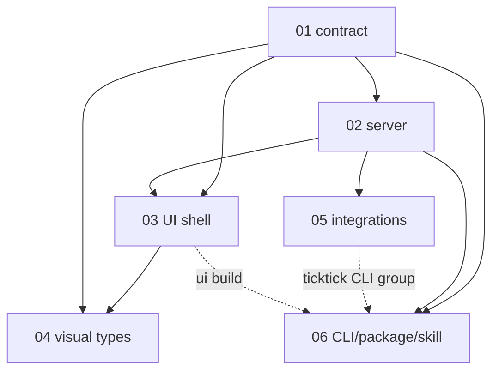

# crontick-dashboard — initial-brainstorming design set

Source of truth: [`brainstorming.md`](brainstorming.md) (32 locked decisions D1-D32). Future ideas: [`../futures.md`](../futures.md). Design only: no code, no TASKS.md yet.

## Sub-projects

| NN | Name | Phase | Depends on | Scope | Path |
|---|---|---|---|---|---|
| 01 | Card contract | 1 | none | Envelope + 5 type data schemas (Zod 4 -> JSON Schema), formats, `validateCardFile`, examples | [01-card-contract/PRD.md](01-card-contract/PRD.md) |
| 02 | Server core | 2 | 01 | Data dir, watcher/ingest, pure snapshot compute (window/Broken/Now/Done), archive, mutations, HTTP API, lifecycle, shared DTOs | [02-server-core/PRD.md](02-server-core/PRD.md) |
| 03 | UI shell | 3 | 01 (types), 02 | Theme tokens, header/Now/grid/Done tray, card frame, client registry, search, polling | [03-ui-shell/PRD.md](03-ui-shell/PRD.md) |
| 04 | Visual types | 4 | 01, 03 | markdown/table/list/kpi/media body components | [04-visual-types/PRD.md](04-visual-types/PRD.md) |
| 05 | Integrations | 3-4 | 02 (events, action registry) | OS notifications (adapter), TickTick MCP complete + intent-file fallback, `ticktick` CLI logic | [05-integrations/PRD.md](05-integrations/PRD.md) |
| 06 | CLI, packaging, skill | 4-5 | 01, 02 (consumes 05 CLI group) | Commander CLI, tsup+Vite build, npm package, SKILL.md, install verify, CI | [06-cli-packaging-skill/PRD.md](06-cli-packaging-skill/PRD.md) |

Build order: 01 -> 02 -> (03, 05 in parallel) -> 04 -> 06.

## Locked cross-cutting picks

- Language: TypeScript everywhere (owner-confirmed). Node >=22.5 ESM, tsup (server/CLI), vitest, UI = React + Vite + TS. Commander, Hono, croner, env-paths, zod.
- Schema: Zod 4 is the source; JSON Schema generated + committed (CI diff); TS types inferred (01).
- Ingest: `fs.watch` flat + 10 s rescan, 200 ms debounce, settle-retry on truncated JSON before Broken (02).
- API: pure `GET /api/snapshot` (ETag, poll 15-60 s); mutations need JSON content-type + `X-Crontick-Dashboard` header; Host check; loopback only (02). Default port `47616`.
- Repo layout (06): `src/contract` (01), `src/{paths,config,lifecycle}.ts` + `src/{state,feed,compute,actions,http,shared}` (02), `src/integrations/{notify,ticktick}` (05), `src/cli` + `src/skill` (06), `ui/` (03/04), `schemas/`, `templates/`, `scripts/`, `tests/`. Shared DTOs: `src/shared/api-types.ts` (02-owned, type-only).
- Build: gen:schemas -> `vite build` (`ui/dist`) -> tsup, `onSuccess` copies to `dist/ui`.
- Theme (03): Glance-style HSL token triples + CSS `calc()` derivation, system default + toggle, system-ui fonts, no JS theme runtime.
- Notifier (05): `NotifyAdapter` interface, `node-notifier` default behind it, `notifications.os` auto|on|off, headless = in-page only.
- TickTick (05): MCP client (`complete_task(project_id, task_id)`, OAuth or bearer token); on auth/transient failure or `mode: intent` write an intent file applied by a scheduled Claude job; UI shows pending.
- Ownership: 01 card shape/validator; 02 API/snapshot/handlers/lifecycle; 03 UI registry/deep links; 06 CLI/layout.
- Reconciled across PRDs: validator API (`validateCardFile`), Broken `reason`+`message` in snapshot, handler `pending` + `pendingItems`, id-vs-filename Broken, no `show.tz`, list `checked` union, alerts = markdown/list/kpi only, Vite output handoff, `#card=<id>` deep link, CLI `ticktick` group + config keys, no CSP, `DEFAULT_PORT`.

## Owner decisions needed (remaining [OPEN])

**Product / behavior**
| Decision | PRD ref | Recommendation |
|---|---|---|
| Now priority threshold default (3 vs 4) | 01 OPEN-7, 02 OPEN-NOW | 3 |
| `show.for` default when omitted | 01 OPEN-3, 02 | End of that local day |
| Do alerts honor `show` | 01 OPEN-4 | Yes, cron-gated like panels |
| Server-down UI: dim-and-keep vs blank (D19 wording) | 03 OPEN-4 | Dim + banner with last-update time |
| Lowercase-only ids (<=64, Windows-safe) | 01 OPEN-1 | Accept |
| kpi: one metric vs multi-metric `items` | 01 OPEN-5 | One per card, defer multi |
| `ms-outlook:` link scheme allowlist | 01 OPEN-6 (03/04 follow) | http/https/mailto only; add later |
| Local image files (`<data>/media/` route) | 04 OPEN | Not v1; add to futures.md |
| List item `due` in schema vs extra | 04 OPEN | Leave as extra |
| `crontick-dashboard skill install` command | 06 OPEN-3 | Add if cheap; v1 docs only |

**Technical (agent can decide at task time; listed for visibility)**
| Item | PRD ref | Recommendation |
|---|---|---|
| react-grid-layout v1 vs v2 (React 19) | 03 OPEN-5 | Check compat at task time |
| Smoke runner: Playwright vs puppeteer-core | 03 OPEN-6 | Playwright |
| croner previous-run lookup (else cron-parser) | 02 OPEN | Verify first task of 02; same lib as 01 |
| `info --json` field freeze | 06 OPEN-7 | Freeze at task time |
| Notification lib final (spike Win+mac) | 05 OPEN-2 | node-notifier behind adapter |
| TickTick OAuth DCR / third-party client acceptance | 05 OPEN-3 | Spike w/ MCP Inspector; design survives "no" |
| TickTick error shapes + `get_task_by_id` probe | 05 OPEN-4 | Verify in same spike |
| Notify only on ingest, not window-open (accepted) | 05 OPEN-7 | Accept for v1 |

## Owner-only manual steps

- Add git remote; create GitHub repo (also needed for npm provenance).
- `npm publish` (login/2FA); confirm package name `crontick-dashboard` is free.
- TickTick sign-in once (`ticktick connect`, or API token via `--token`); MCP Inspector check.
- Create the intents applier job in crontick from `docs/ticktick-intents-job.md`.
- Copy `SKILL.md` to `~/.claude/skills/crontick-dashboard/` per machine (until `skill install`).
- Windows + macOS: notification permissions, Focus Assist, manual toast test; `daemon start` smoke; global-install check on Windows.
- Decide the owner-decision table above.
- 2 weeks of real daily use (kill-criteria check).

## Next step

Owner resolves the product [OPEN]s above in the owning PRDs (flip to `[RESOLVED: ...]`, set PRD `status: approved`), then run `dev-tasks` over the six PRDs.
