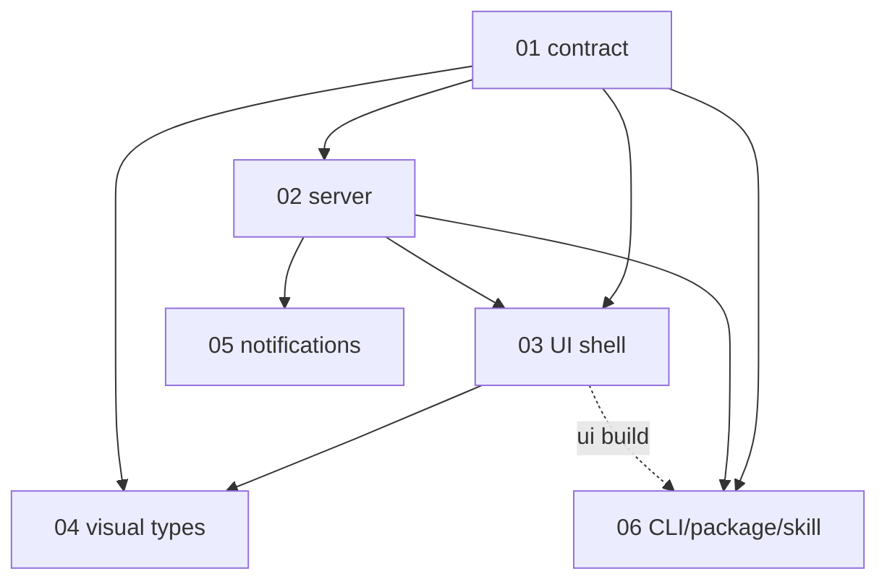

# crontick-dashboard — initial-brainstorming design set

Source of truth: [`brainstorming.md`](brainstorming.md) (32 locked decisions D1-D32). Future ideas: [`../futures.md`](../futures.md). Implementation is approved and underway: six approved PRDs and six settled TASKS.md files cover 59 tasks. All owner choices are settled; the work follows the build order below.

## Sub-projects

| NN | Name | Phase | Depends on | Scope | Path |
|---|---|---|---|---|---|
| 01 | Card contract | 1 | none | Envelope + 5 type data schemas (Zod 4 -> JSON Schema), formats, `validateCardFile`, examples | [01-card-contract/PRD.md](01-card-contract/PRD.md) |
| 02 | Server core | 2 | 01 | Data dir, watcher/ingest, pure snapshot compute (window/Broken/Now/Done), archive, mutations, `complete` write-back into card files, HTTP API, lifecycle, shared DTOs | [02-server-core/PRD.md](02-server-core/PRD.md) |
| 03 | UI shell | 3 | 01 (types), 02 | Theme tokens, header/Now/grid/Done tray, card frame, client registry, search, polling | [03-ui-shell/PRD.md](03-ui-shell/PRD.md) |
| 04 | Visual types | 4 | 01, 03 | markdown/table/list/kpi/media body components | [04-visual-types/PRD.md](04-visual-types/PRD.md) |
| 05 | Notifications | 3-4 | 02 (events, warnings) | OS notifications only (adapter, headless = in-page). TickTick MCP/OAuth/intents removed 2026-10-05 | [05-notifications/PRD.md](05-notifications/PRD.md) |
| 06 | CLI, packaging, skill | 4-5 | 01, 02 | Commander CLI (incl. `skill install`), tsup+Vite build, npm package, SKILL.md, install verify, CI | [06-cli-packaging-skill/PRD.md](06-cli-packaging-skill/PRD.md) |

Build order: 01 -> 02 -> (03, 05 in parallel) -> 04 -> 06.

## Locked cross-cutting picks

- Language: TypeScript everywhere (owner-confirmed). Node >=22.5 ESM, tsup (server/CLI), vitest, UI = React + Vite + TS. Commander, Hono, croner, env-paths, zod.
- Schema: Zod 4 is the source; JSON Schema generated + committed (CI diff); TS types inferred (01).
- Ingest: `fs.watch` flat + 10 s rescan, 200 ms debounce, settle-retry on truncated JSON before Broken (02).
- API: pure `GET /api/snapshot` (ETag, poll 15-60 s); mutations need JSON content-type + `X-Crontick-Dashboard` header; Host check; loopback only (02). Default port `47616`.
- Repo layout (06): `src/contract` (01), `src/{paths,config,lifecycle}.ts` + `src/{state,feed,compute,actions,http,shared}` (02), `src/integrations/notify` (05), `src/cli` + `src/skill` (06), `ui/` (03/04), `schemas/`, `templates/`, `scripts/`, `tests/`. Shared DTOs: `src/shared/api-types.ts` (02-owned, type-only).
- Build: gen:schemas -> `vite build` (`ui/dist`) -> tsup, `onSuccess` copies to `dist/ui`.
- Theme (03): Glance-style HSL token triples + CSS `calc()` derivation, system default + toggle, system-ui fonts, no JS theme runtime.
- Notifier (05): `NotifyAdapter` interface, `node-notifier` default behind it, `notifications.os` auto|on|off, headless = in-page only. 05 = notifications only.
- TickTick write-back (owner 2026-10-05, supersedes D18): no MCP client/OAuth/tokens/`ticktick` CLI/`ticktick.mode`/intents. List item with `action:{type:"complete"}`: ticking makes the server write `checked:true`+`checkedAt` into `feed/<id>.json` (02: atomic tmp+rename, compare-and-rename vs agent writes, `updatedAt` untouched, no notify/archive for self-writes); untick allowed. The agent reads the card on its next run, completes ticked tasks in TickTick with its own access, rewrites the card (06 skill). Task ids = agent-private item extras (`ticktick:{taskId,projectId}`).
- Owner decisions applied 2026-10-05: Now threshold default 3; `show.for` omitted = end of local day, no `show` = always visible; alerts honor `show`; server down = only a "Server down" state, no cards/stale data (03, D19 literal); lowercase-only ids; kpi `data.items` (several metrics, flat form normalized); links `http|https|mailto|ms-outlook`, every link clickable (`javascript:`/`data:`/`file:` rejected); media = http(s)/`data:image` only (local files DEFERRED); list item `due` + `links[]` in schema; agent picks which tasks to list; `skill install` CLI (06).
- Expandable format (01): types are generic, agents add columns/fields freely, extras preserved; `Cell = scalar | {text, link?}`; row link + cell links coexist (04); list items `links[]`.
- Glance borrows in v1 (03/04): CSS `:visited` link colouring in `CardLink` (accent unvisited, muted visited, ↗ tinted; colour only, mailto/ms-outlook never visited); "updated 2h ago" in title bar (60 s tick, paused when hidden); compact "+N more" opens fullscreen; `S` focuses search, `Esc` blurs; 2-line clamp + `title` tooltip; spinner only after 150 ms.
- Deferred Glance ideas (not specced, see `glance-borrow.md`): row dimming for visited links, hide-header/`hideTitle`, card-level `link`, image fade-in, custom CSS file, density tokens, emoji `icon`, date-column relative times, inline expand ("Show more"), theme presets picker; rejected: CDN icons, popovers, cached-data notice icon (conflicts D19), mobile.
- Ownership: 01 card shape/validator; 02 API/snapshot/handlers/lifecycle; 03 UI registry/deep links; 06 CLI/layout.
- Reconciled across PRDs: validator API (`validateCardFile`), Broken `reason`+`message` in snapshot, id-vs-filename Broken, no `show.tz`, list `checked` union (item.checked incl. write-backs + dismiss ids + optimistic), alerts = markdown/list/kpi only, Vite output handoff, `#card=<id>` deep link, config keys (`notifications.os`; `ticktick.mode` removed), no CSP, `DEFAULT_PORT`.

## Owner decisions needed

None remaining. All items resolved 2026-10-05 and applied in the PRDs.

## Owner-only manual steps

- `npm publish` (login/2FA; optional: alternatively `npm i -g .` from a clone); confirm package name `crontick-dashboard` is free. (Git remote already exists: origin github.com/tejitpabari99/crontick-dashboard.)
- Install the skill yourself: `crontick-dashboard skill install` (copies `SKILL.md` to `~/.claude/skills/crontick-dashboard/`; `--force` to overwrite after upgrades). Nothing to install now.
- Windows + macOS: notification permissions, Focus Assist, manual toast test; `daemon start` smoke; global-install check on Windows.
- Set up the crontick job(s): an agent (with its own TickTick MCP access) that on each run reads the existing card file, finds list items with `checked: true`, completes those tasks in TickTick using the item's `ticktick:{taskId,projectId}` extras, then rewrites the card with the current important tasks (new `updatedAt`). No TickTick sign-in or app registration for the dashboard.
- 2 weeks of real daily use (kill-criteria check).

## Next step

Implement the 59 settled tasks in order: 01 -> 02 -> (03 and 05 in parallel) -> 04 -> 06. Sub-project 01 Task 1 is in progress. Track implementation status in each TASKS.md; retain the approved design and settled choices.
